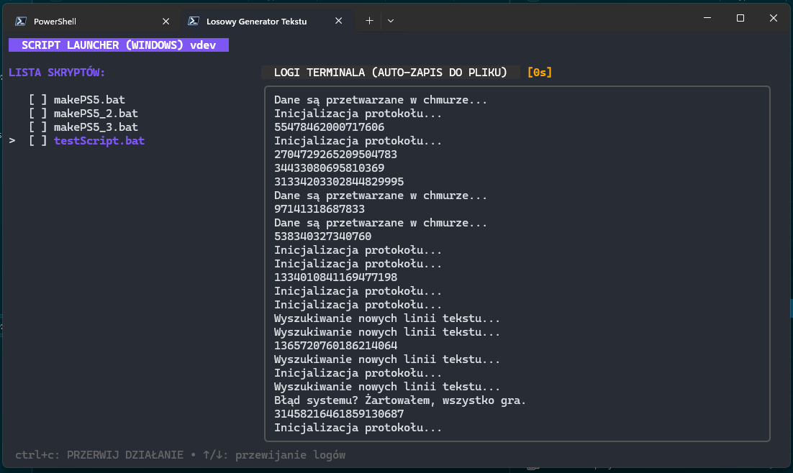

# 🚀 GoBatManager - Universal Script Launcher

A modern, terminal-based GUI (TUI) built with Go and the **Bubble Tea** framework. It allows you to manage, preview, and execute `.bat` (Windows) or `.sh` (Linux/macOS) scripts in a clean, organized interface with real-time logging and a persistent history.

## ✨ Features

- **Auto-discovery**: Automatically scans the current directory for executable scripts (`.bat` or `.sh`).
- **Execution Queue**: Select multiple scripts using `x` and run them sequentially with one press of `Enter`.
- **Real-time Logs**: Watch script output live in a scrollable viewport.
- **Background Logging**: Every execution is automatically saved to a `<script_name>.log` file.
- **Safe Interruption**: Use `Ctrl+C` to stop a running script without closing the entire application.
- **Code Preview**: Press `Space` to peek inside a script's source code before running it.
- **Persistent Stats**: Tracks and saves execution times in `script_times.json`.
- **Modern UI**: Built with `Lip Gloss` for a beautiful, responsive terminal experience.



## 🛠 Prerequisites

- **Go**: Version 1.21 or higher.
- **Terminal**: A modern terminal (Windows Terminal, iTerm2, or any XTerm-compatible).

## 📥 Installation & Compilation

### 1. Clone and Prepare

```bash
git clone https://github.com/superswierk/GoBatManager.git
cd GoBatManager
go mod tidy
```

### 2. Compile

**For Windows:**

```bash
go build -o GoBatManager.exe main.go
```

**For Linux/macOS:**

```bash
go build -o GoBatManager main.go
chmod +x GoBatManager
```

## ⌨️ Controls

| Key | Action |
| :--- | :--- |
| `↑` / `↓` | Navigate through the script list |
| `Enter` | Run selected script or start the queue |
| `Space` | Toggle source code preview |
| `x` | Add/Remove script from the execution queue |
| `Ctrl+C` | **If running:** Stop current script / **If idle:** Quit app |
| `q` / `Esc` | Back to list or Exit application |
| `Mouse Wheel` | Scroll through logs |

## 📄 License

MIT License.

---
*Created with ❤️ using Go and Charmbracelet Bubble Tea and Gemini*